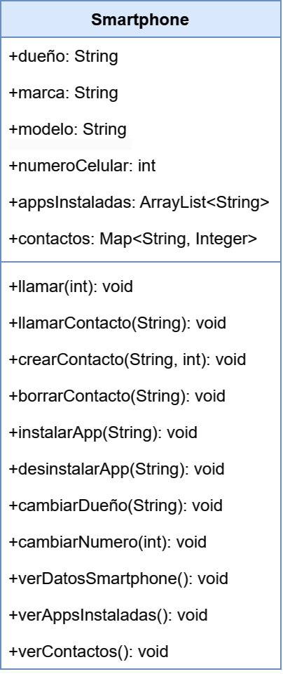

## Evidencia05: Caso del automóvil y la POO
### Objetivo: 
Aplicar los conceptos básicos de modelado de clases e instanciación de objetos con LDP Java, terminando el caso iniciado en clases.

### Desarrollo
Para la actividad se seleccionó como objeto del mundo real un **Smartphone**.

### Representación UML

